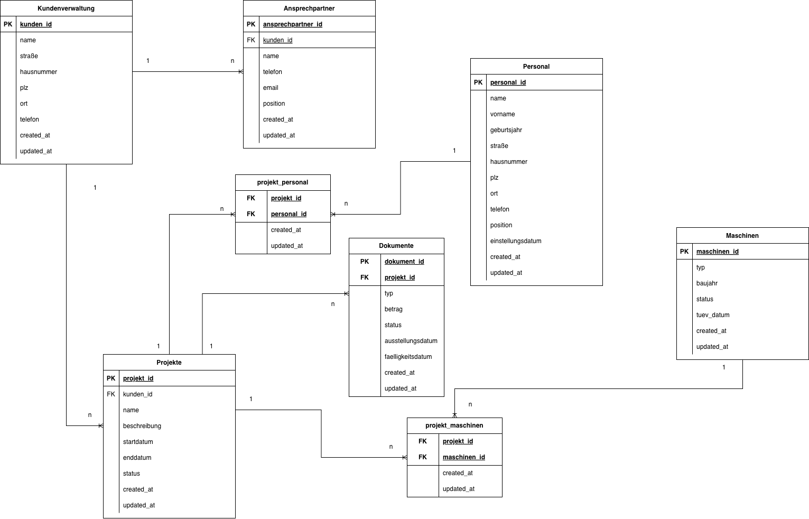

#  Gleisbau-CRM
## Ein CRM speziell für Gleisbauunternehmen

## Features: 
- Kundenverwaltung
- Projekte
- Angebote
- Maschinen
- Personal

## Tech Stack: 
- React
- FastAPI
- SQLite

## Installation: 
1. Repository 
2. In *backend* navigieren
3. venv erstellen 
4. venv aktivieren
5. Pakete installieren: pip install -r requirements.txt 

## Datenbankschema
